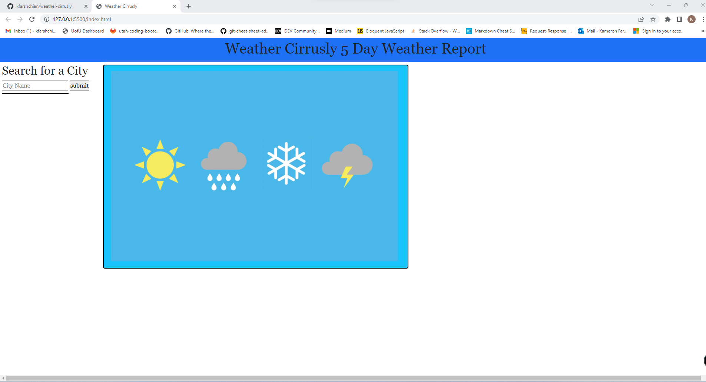
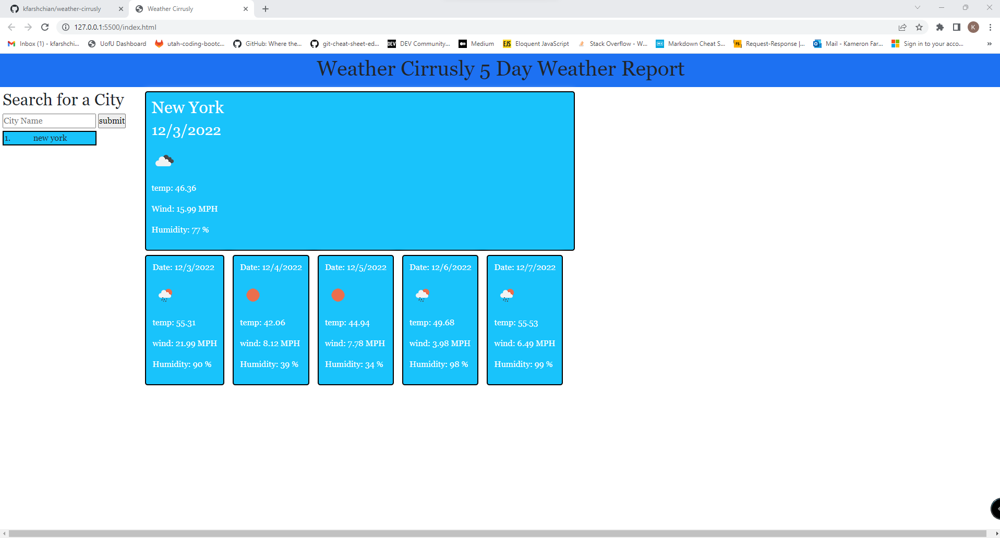

# Weather Cirrusly

## Description
This site is a 5-day weather application that lets you search by the name of the city you may be traveling to. It shows the current days weather and the following 5 days after. The site was built using two APIs from openweather. The first API is the current day weather, and the second API is the forecast for 5 days after the current day. The city name that is searched is added to local storage and then gets put into the search history bar so that you can go back to that city without having to re-enter the name. I hope you enjoy testing this site out. 

## Installation

All files, folders, and images will be needed to guarantee functionality.  

## Usage

https://kfarshchian.github.io/weather-cirrusly/

## Credits

N/A

## License

Please refer to the LICENSE in the repo.
